# Project 1 (Dev Community website)
 

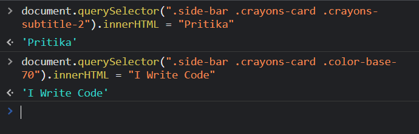
 
 

 
 
 

# Project 2 (Apple Website)
 

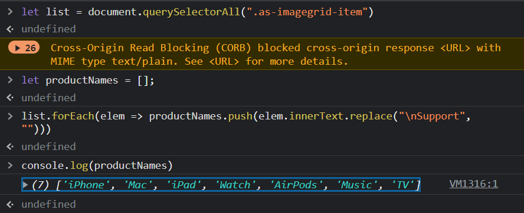

 
 
 

# Project 3 (YouTube Support Website)

 
 

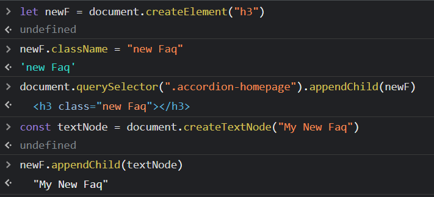

 
 

 
 
 

# Project 4 (One Plus Website)
 
 

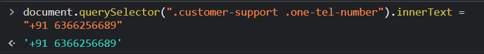

 
 

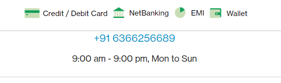

 
 
 

# Project 5 (Samsung Website)

 
 

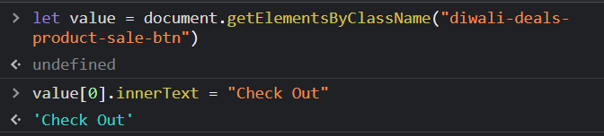

 
 

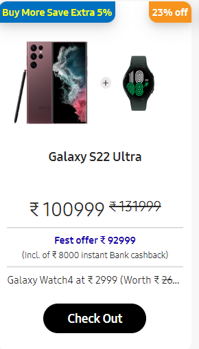

 
 
 

# Project 6 (Adidas Website)

 
 

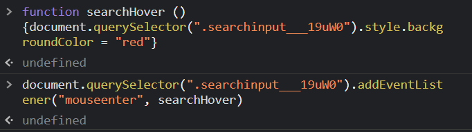

 
 

 
 
 

# Project 8 (Google Website)
 
 

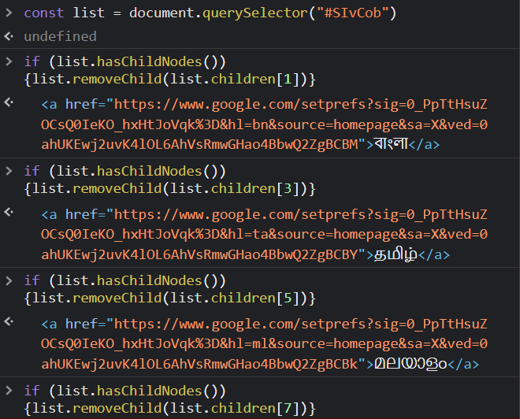

 
 

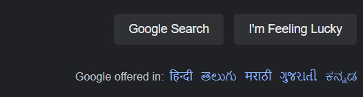

 
 
 

# Project 9 (CodeWars Website)

 
 

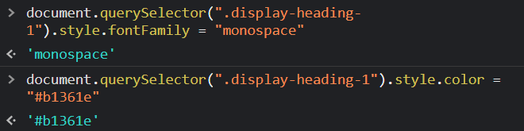

 
 

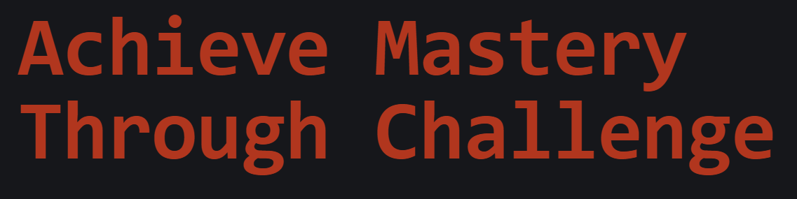

 
 
 

# Project 10 (FreeCodeCamp Website)

 
 

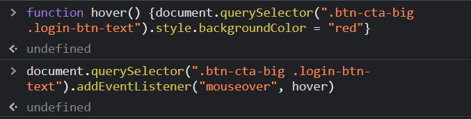

 
 

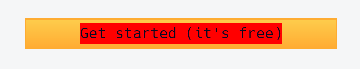

 
 
 

# Project 11 (realme website)

 
 

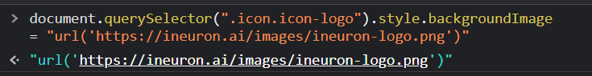

 
 

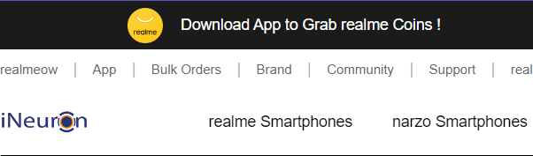

 
 
 

# Project 12 (Github Website)

 
 

 
 

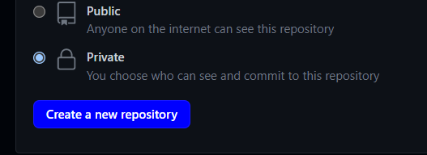

 
 
 

# Project 13 (HackerRank Website)

 
 

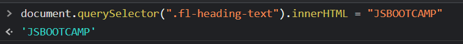

 
 

 
 
 

# Project 14 (Asus Website)

 
 

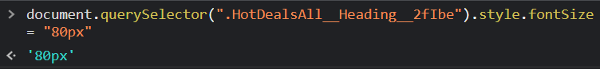

 
 

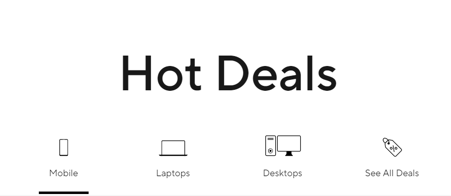

 
 
 

# Project 15 (Dell Website)

 
 

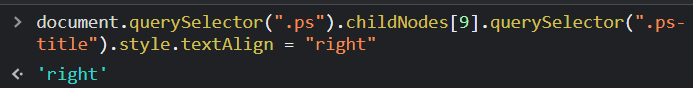

 
 

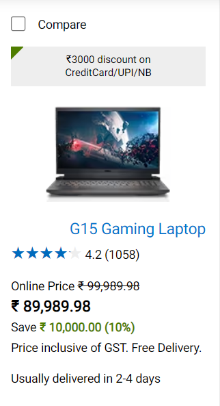

 
 
 

# Project 16 (Vercel Website)

 
 

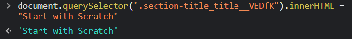

 
 

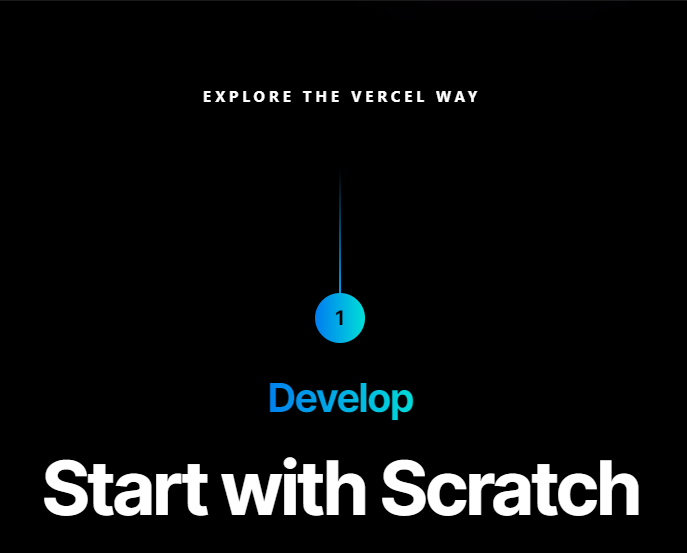

 
 
 

# Project 17 (Sony Website)

 
 

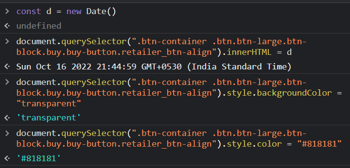

 
 

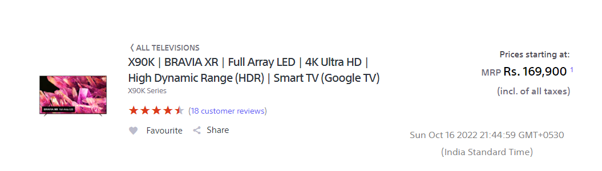

 
 
 

# Project 18 (Philips Website)

 
 

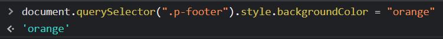

 
 

 
 
 

# Project 19 (Canon Website)

 
 

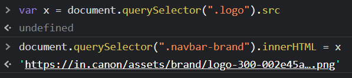

 
 

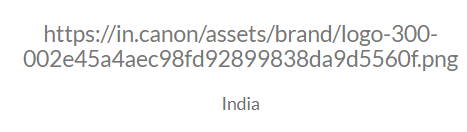

 
 
 

# Project 20 (Oppo Website)

 
 

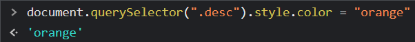

 
 

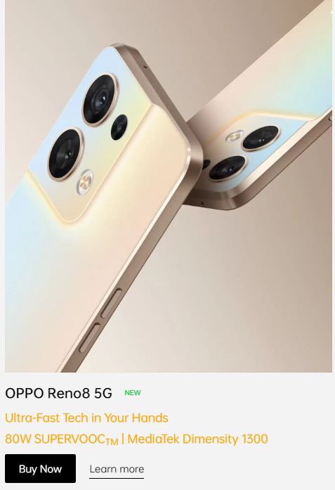

